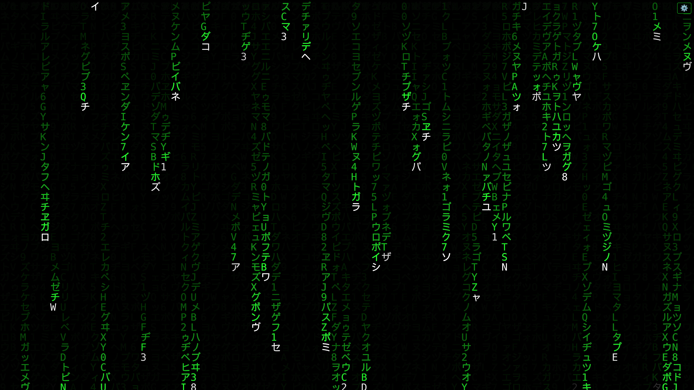

# 🟢 Matrix Digital Rain - Ultimate Edition

A highly configurable, lightweight, and interactive recreation of the iconic "Digital Rain" effect from *The Matrix*. 

Built entirely with **HTML5 Canvas** and **JavaScript** in a single file. No external libraries or dependencies required.

*(Tip: Replace this line with a link to a screenshot of your project if you have one)*

## ✨ Key Features

* **⚡ zero-dependencies:** Just a single HTML file. Works in any modern browser.
* **🎮 Interactive Settings Panel:** Click the gear icon (⚙️) to tweak the simulation in real-time.
* **🌈 Multiple Color Modes:**
    * **Monochrome:** Classic Matrix look (customizable color).
    * **Rainbow (Clean):** Smooth HSL gradient across the screen.
    * **Tivoli (Chaos):** Total color anarchy for a glitch/confetti effect.
* **✨ Visual Fidelity:**
    * **"White Tip" Effect:** The leading character glows white, while the trail fades to color (just like the movie).
    * **Variable Speeds:** Each column falls at a different speed to create depth (parallax effect).
    * **Crisp Rendering:** Custom logic prevents character smearing/overlapping artifacts.
* **📱 Responsive:** Automatically adjusts column count when the window is resized.

## 🚀 How to Run

1.  Download the `index.html` file.
2.  Open it in any web browser (Chrome, Firefox, Safari, Edge).
3.  Enjoy the rain!
4.  Click the **Gear Icon (⚙️)** in the top right corner to open the configuration menu.

## ⚙️ Configuration Options

You can adjust the following settings on the fly:

* **Color Mode:** Switch between Classic, Rainbow, or Chaos.
* **Color Picker:** Choose the base color (active in Monochrome mode).
* **Font Size:** Adjust the density of the rain.
* **Fade (Trail Length):** Controls how quickly the characters disappear.
    * *Low value (0.01) = Long, ghostly trails.*
    * *High value (0.20) = Short, fast droplets.*
* **Min/Max Speed:** Control the chaos. Set high speeds for a "storm" effect, or low speeds for a "system idle" look.
* **White Tip:** Toggle the white leading character on/off.

## 🛠️ Technical Details

This project uses the HTML5 `<canvas>` element.
* **State Management:** Arrays track the Y-position, speed, and accumulated velocity of each column.
* **Rendering Loop:** A custom drawing loop runs every ~20ms. It uses a semi-transparent black rectangle to create the "fading trail" effect instead of clearing the screen each frame.
* **Bug Fixes:** Includes specific logic to clear the previous "white tip" character before drawing the green trail, ensuring characters remain sharp and legible.

## 📜 License

This project is licensed under the **GNU General Public License v3.0** - see the [LICENSE](LICENSE) file for details.

---

*Created with code and creativity.*
